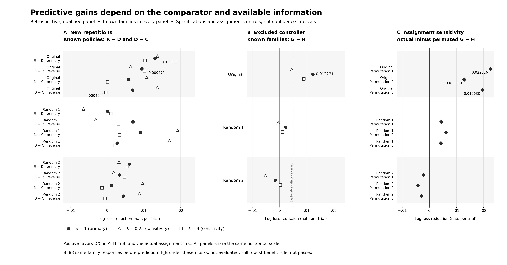

# Intervention geometry and error profiles in a frozen language model

## Abstract

Average accuracy does not reveal how activation interventions redistribute errors across problems. In a frozen Qwen3-8B/CRUXEval laboratory, all sixteen prospectively sampled, qualified directions showed positive angular associations with error-profile distances against a fixed atlas (mean shell-averaged Spearman correlation 0.691). A separate fixed-controller test established localized complementarity. Subsequent analyses provided exploratory evidence of repeatable probability-scale structure, while showing that monotonic skill–difficulty models explain substantial variation. Predictors fitted to fixed controller coordinates improved a restricted known-family comparison, but this gain was specification-sensitive. A matched-orientation pilot remained inconclusive on subspace specificity, and fresh-population qualification did not establish prospective selection utility. Together, these results characterize relational error structure while distinguishing it from crossed specialization, new-task prediction, and useful policy selection.

## Introduction

Average accuracy compresses a model's behavior into a single number. Two activation interventions may yield similar averages while succeeding on different problems. Conversely, an intervention can change many answers without producing a useful redistribution of correct responses. Studying the location of errors therefore requires more than measuring aggregate performance or output diversity. It requires an answer channel that remains interpretable, an estimand that distinguishes constant probability shifts from profile changes, and observations that separate stable differences from variation between repeated generations.

We study fixed interventions in the activations of a frozen language model. A controller denotes a specified intervention policy, including its direction and dose; it does not denote a separately trained model. Our main question is whether relations among controllers anticipate relations among their error profiles. This differs from asking whether a particular direction represents a semantic concept, whether interventions induce reproducible reversals in which policy is best, or whether a router can select a beneficial intervention before answering a new problem. Those questions require different evidence.

The empirical core consists of a fixed-controller complementarity study and a relational study with prospectively sampled controller identities. The first establishes a qualified instance of changed error structure. The second tests geometric alignment within a fixed intervention laboratory. Subsequent analyses examine how much of the observed structure repeats, whether the constructed subspace is distinguished from matched random orientations, and what predictive information remains under specified training masks. Utility studies provide a separate practical boundary. This organization places successful and unsuccessful results in the same argument without pooling their populations or treating every stage as independent confirmation. [E5]

The resulting claim is deliberately comparative. Geometry organizes part of the measured error structure in this laboratory. Predictors fitted to the fixed controller coordinates can also improve a specified conditional comparison, but the improvement is sensitive to specification and does not establish superiority to a family-only predictor under the same masks. The practical importance of this distinction is visible in the results: a substantial monotonic explanation coexists with geometric association, while promising development selection does not become demonstrated prospective utility. The contribution is this quantitative separation, rather than a new steering algorithm or a claim that error diversity necessarily yields specialists.

We characterize intervention-induced error profiles, test whether pre-outcome geometry generalizes to new controller identities, and examine which interpretations survive comparisons with monotonic skill–difficulty models and practical selection studies.

## Related work

Activation Addition (ActAdd) constructs steering vectors from contrasts between prompt activations; Contrastive Activation Addition (CAA) averages activation differences between positive and negative behavioral examples and adds the resulting vectors during inference. These are direct antecedents for the intervention operation used here. Our empirical object is the relation among fixed interventions and their error profiles. [Turner et al., ActAdd](https://arxiv.org/abs/2308.10248v5), [Panickssery et al., CAA](https://arxiv.org/abs/2312.06681v4).

The MoSV research repository describes a bank of clustered contrastive vectors and a sparse router mapping prompt hidden states to weighted vector combinations. This is a close architectural comparison for bank-and-router studies; we cite its documented design as a research artifact, without treating its reported performance as an independently verified benchmark or peer-reviewed finding. [MoSV repository](https://github.com/lee-dan/Mixture-of-Steering-Vectors-MoSV) (README accessed 10 September 2026).

Composing steering directions for adaptation is already an active research approach. Han et al.'s *Steer2Adapt* searches combinations within a reusable subspace using Bayesian optimization and an objective that rewards corrections while penalizing regressions. Our fixed-controller comparisons address the structure of responses after interventions have been specified. They do not establish a more efficient adaptation procedure or a competitive reduction in the cost of finding a useful direction. This distinction matters when interpreting our budgeted replay, whose small opportunity gains do not demonstrate end-to-end savings. [Steer2Adapt](https://arxiv.org/html/2602.07276v1)

Zhu et al.'s STARS method steers concurrent generation trajectories through a Stiefel formulation involving orthogonality and volume. Its online diversification objective differs from measuring error profiles of fixed policies over shared families. Aparin and Gaintseva separate activation steering into angular and norm effects, including controls on hidden-state geometry. Our angular metric instead compares controller coefficients. Equal coefficient geometry across rotated subspaces does not equate hidden-state angles, semantic effects, or response reliability. [STARS](https://arxiv.org/html/2601.22010v1), [Angle–Norm Decomposition](https://arxiv.org/html/2606.06735v1)

The measurement problem also connects to representational geometry. Diedrichsen et al. explain how independent-partition products avoid self-noise bias and why distances sharing conditions are statistically dependent. We use the same general cross-partition principle for binary correctness profiles, without implementing whitened unbiased-distance-matrix similarity or inheriting its guarantees. Our sampling units must follow the controller and family design rather than the number of entries in a distance matrix. [Representational geometries](https://www.diedrichsenlab.org/pubs/NBDT_2021.pdf)

Finally, item-response and low-rank models provide established explanatory alternatives. *tinyBenchmarks* uses ability, discrimination, and difficulty to model language-model correctness for efficient evaluation. Generalized low-rank models encompass regularized logistic factorization and its nonconvex optimization. Our use of family discrimination and coordinate-linked rank-one terms applies these ideas to interventions of one frozen model. We neither introduce factorization theory nor demonstrate benchmark compression. The relevant question is which constrained predictor improves under a declared information boundary, not whether an unconstrained latent factor can be given a semantic name. [tinyBenchmarks](https://arxiv.org/html/2402.14992v2), [Generalized Low Rank Models](https://arxiv.org/pdf/1410.0342v4)

## Methods

The principal laboratory fixes Qwen3-8B [M1], CRUXEval [B1], intervention layer 27, and a rank-eight subspace. The historical relational panel contains 300 items and 31 qualified controllers; a later prospective controller sample adds sixteen identities. Qualification restricts the population to interventions that meet the prespecified response-channel and intervention-integrity criteria; qualification here is not a general assessment of model safety. It therefore supports conclusions about eligible controllers, not arbitrary activation perturbations. Historical transfer studies use separate tasks and, where applicable, models; their results are reported separately. [E1] [E2] [E4] [E5]

For Q2, eight source directions were formed from mean positive-minus-negative instruction-conditioned activation differences: control-flow path coverage, mutation/alias causality, loop-boundary accounting, and hypothesis-branch elimination, each captured at the final prompt token and at an execution boundary after a fixed teacher continuation. Each source column was normalized before SVD; the retained left singular vectors form the frozen orthonormal basis \(Q\), with \(Q^\top Q=I_8\). Candidate coefficients were sampled once as \(g\sim N(0,I_8)\), \(c=g/\|g\|\), and mapped to unit directions \(v=Qc\). OOS v2 used its own precommitted PCG64DXSM stream of 34 candidates and selected the first 16 passing both shells, without redraw. Source construction and coefficient sampling precede semantic evaluation; these coordinates are fixed descriptors, not parameters learned by the later predictor.

The intervention modifies the output hidden state of `model.model.layers[27]` as \(h_t^{27}\leftarrow h_t^{27}+\alpha_{k,s}v_k\). It is sustained: applied to the final non-padding prompt token during prefill and the current token once per decode forward, without editing cached past positions. MEDIUM and STRONG target relative implemented perturbation amplitudes 0.25 and 0.50. Calibration selects alpha using the BF16-rounded perturbation norm divided by the square root of the mean squared baseline hidden-state norm over the final prompt and fixed teacher-continuation positions; these are reference-calibrated targets, not guarantees of identical movement relative to every generated state. Q2 generation uses BF16/SDPA, sampling temperature 0.6, top-p 0.95, top-k 20, min-p 0, a 4096-new-token cap, and thinking disabled. The canonical code-output user prompt has no system message; no project-supplied repetition/frequency/presence penalties or stop strings are added. OOS v2 additionally applies its frozen extreme-mechanical-repetition terminal rule, scored as channel failure/error rather than retried for a better answer. The normative regime is serial, with row-specific frozen seeds.

These settings describe Q2 v4.1 and its OOS extension, not a pooled Q1/Q2/router regime. Q1 instead freezes development-selected careful-minus-direct mean-difference controllers: Qwen D75 and Ministral D25, both at layer 27 with sustained current-token application. Its identity lock gives Qwen temperature 0.6/top-k 20 and Ministral temperature 0.3/top-k 0; both use top-p 0.95, min-p 0, BF16/SDPA and a 4096-token cap. Q1 doses are not Q2 shell labels. Q3 is a separately frozen bank-and-router transfer study (E6–E9), not a fresh draw from the Q2 protocol. Exact method sources and frozen file identities are indexed in [DISCUSSION_EVIDENCE.md](DISCUSSION_EVIDENCE.md).

A family denotes the underlying scored problem in these panels, not a rollout or a broad task category. For family i, controller k, and rollout r, correctness is a binary observation. Repeated generations provide repeated observations of a response probability, not new independent families. Frozen scoring preserves invalid and unevaluable outcomes as errors rather than discarding them. Complementarity is evaluated using the frozen competence-adjusted statistic C_comp together with competence and channel guards. Shape displacement removes a constant probability-scale shift between policies. It does not remove all effects of global competence, family difficulty, or response-channel failures. Exact definitions, parsers, and stage-specific protocols are retained in the linked evidence bundle. [E1] [E4] [E5]

Q1 used 57 prospectively assigned CRUXEval items, with two rollouts per condition and four frozen random-null controllers; the meaningful controllers themselves were selected in development. Let \(e_{ir}^{k}=1\) denote an error (zero denotes success), with policy 0 the baseline, and let \(q_i^k=(e_{i1}^k+e_{i2}^k)/2\). For n items, the complementarity statistic is

\[
C_{\mathrm{comp}}=B_{00}-B_{0k}-U_{00}+U_{0k},\qquad
B_{00}=\frac1n\sum_i e_{i1}^0e_{i2}^0,\qquad
B_{0k}=\frac1n\sum_i q_i^0q_i^k,
\]
\[
U_{ab}=\frac{(\sum_i q_i^a)(\sum_i q_i^b)-\sum_i q_i^aq_i^b}{n(n-1)}.
\]

Positive C_comp denotes reduced baseline-associated error overlap after this marginal adjustment; it is not an accuracy gain or proof of crossed specialization. C_comp corresponds to archived statistic C; model labels R/D/C/G/H below denote explanatory specifications, and model D is distinct from a displacement statistic. Q1 population and controller locks: [Q1 protocol](https://github.com/ACS-USP/causal-epistemic-geometry/blob/6780ee36276241d2447cb81d67a53f023ba64a70/review/q1_confirmatory_fixed_controllers/PROTOCOL_LOCK.md); [four-null lock](https://github.com/ACS-USP/causal-epistemic-geometry/blob/6780ee36276241d2447cb81d67a53f023ba64a70/review/q1_confirmatory_fixed_controllers/NULL_BANK_LOCK_QWEN.json); formula: [Q1 independent implementation](https://github.com/ACS-USP/causal-epistemic-geometry/blob/6780ee36276241d2447cb81d67a53f023ba64a70/scripts/audit_q1_confirmatory.py).

For Q2, define the population error probability \(p_i^k=\Pr(e_{ir}^k=1)\). For a fixed panel the shape target is \(n^{-1}\sum_i[(p_i^k-p_i^l)-\overline{(p^k-p^l)}]^2\), the variance across families of the policy difference in error probability. For policy pair k,l define \(d_{ir}=e_{ir}^k-e_{ir}^l\). With two rollouts, total displacement and finite-panel shape displacement are

\[
\widehat D^{\mathrm{total}}_{kl}=\frac1n\sum_i d_{i1}d_{i2},\qquad
\widehat D^{\mathrm{shape,panel}}_{kl}=\frac1n\sum_i d_{i1}d_{i2}
-\left(\frac1n\sum_i d_{i1}\right)\left(\frac1n\sum_i d_{i2}\right).
\]

The item-population version multiplies shape by n/(n−1); its superpopulation interpretation additionally assumes IID item sampling. Historical Q2 v4.1 and fresh-controller Q2 OOS v2 both use that version, whereas the specificity pilot averages the finite-panel centered cross-products over all distinct rollout pairs, without the item-population multiplier. Negative estimates are retained. Positive common scaling leaves within-panel rank association unchanged. These estimators target profile differences under the stated independence assumptions; they are not distances between individual output strings. Definitions and stage usage: [shape implementation](https://github.com/ACS-USP/causal-epistemic-geometry/blob/6780ee36276241d2447cb81d67a53f023ba64a70/src/epistemic_geometry/experiments/q2_v4.py); [historical analyzer](https://github.com/ACS-USP/causal-epistemic-geometry/blob/6780ee36276241d2447cb81d67a53f023ba64a70/scripts/analyze_q2_v4_1_semantic.py); [fresh-reference estimator](https://github.com/ACS-USP/causal-epistemic-geometry/blob/6780ee36276241d2447cb81d67a53f023ba64a70/src/epistemic_geometry/experiments/q2_oos_fresh_controller.py); [pilot estimator and activity gate](https://github.com/ACS-USP/causal-epistemic-geometry/blob/6780ee36276241d2447cb81d67a53f023ba64a70/scripts/geometry_specificity_pilot.py).

The static angular metric A0 is one minus the cosine between controller coefficient vectors. A1 uses covariance-whitened geometry; A2 uses finite-response information fixed before semantic outcomes. Equal-shell comparisons hold the prescribed intervention amplitude category fixed and assess rank association with error-shape distances. The prospective controller analysis computes a shell-averaged association for each new controller against the fixed historical atlas. The primary sampling units are sixteen fresh direction identities selected by the frozen qualification rule: the first sixteen eligible candidates in an immutable stream. A direction identity is distinct from a direction-plus-dose policy; there are 496 fresh-to-reference pairs per shell, not 496 independent trials. Conditional on the task panel, realized reference atlas and qualification design, the binomial sign calculation assumes independent controller signs and tests a positive-sign probability of at most one half; with sixteen positive and no zero signs its one-sided tail is 2^−16. This calculation does not incorporate uncertainty from rebuilding the atlas or selecting the research program. The final positive-sign implementation retains exact zeros as non-successes (none occurred), as specified in the [final replacement protocol](https://github.com/ACS-USP/causal-epistemic-geometry/blob/6780ee36276241d2447cb81d67a53f023ba64a70/review/q2_oos_fresh_controller_design/v2_final_presemantic/V2_FINAL_PROTOCOL_LOCK.json). Item-bootstrap quantiles whose calibration was subsequently rejected are treated as perturbation sensitivities, not conventional confidence intervals. [E4] [E5]

Repeatability is assessed retrospectively on the exposed 300-family by 47-policy MEDIUM panel with two rollouts. Double centering removes row and column means from each rollout matrix. The cross-rollout product S targets stable probability-scale interaction under conditional rollout independence; E summarizes observed centered energy. The signed ratio S/E describes reproducibility in this finite panel. It is not a proportion of variance explained by geometry. In particular, applying a sigmoid to additive skill and difficulty can produce probability-scale interaction without reversing policy order. [E11]

The specificity pilot holds controller coefficient relations fixed while changing orientation: the original subspace and two random rank-eight orientations use common coefficient indices. Calibration considered 24 candidates per orientation, with no redraw to replace unfavorable outcomes. Nineteen qualified in common and the first twelve were retained. Evaluation used eight new rollouts on sixty previously exposed families, with a contemporaneous baseline. Thus the rollout collection was prospective, but the family population was already known and intersection qualification selected the target population. The principal contrast compares original alignment with the mean of two random alignments; it does not test mutual equivalence of all orientations. [E12]

The explanatory comparison subsequently reuses this exposed panel. Stage A trains on rollouts 0–3 and predicts 4–7 for known policies and families, then reverses those halves. For linear predictor eta and success probability sigmoid(eta), Rasch R uses eta = a_i + b_k. Positive-discrimination model D uses eta = a_i + exp(h_i)b_k, allowing families to differ in sensitivity while preserving a common policy ordering. Coordinate-interaction C uses eta = a_i + b_k + u_i wᵀx_k. C and D are alternative specifications; their loss difference is not an additive variance decomposition. [E13] [E14]

Stage B excludes every label of a controller and predicts its responses using the other eleven controllers. G uses eta = a_i + betaᵀx_k; H adds u_i wᵀx_k. Centering uses training controllers only. Each known family nevertheless supplies eleven times eight, or 88, responses before prediction of the excluded controller. The evaluation concerns new controller labels within known families, not prediction from the text of an unseen task. No family-only F_B model was evaluated under these masks. The F model from Stage A cannot substitute for that missing comparison because its training and evaluation split differs. [E13]

Fixed penalties are 0.25, 1, and 4, with 1 primary. Three coordinate-assignment permutations were executed at the primary penalty. We report family-first average log loss in nats per trial and Brier loss separately; positive gain means baseline loss minus candidate loss. Assignment comparisons subtract permuted G−H from actual G−H because permutation changes both models. Training objectives select initialization results. Internal holdouts constrain fitting, but do not erase prior researcher exposure or adaptation of the research program. All numerical values below are taken from immutable published artifacts, with no refitting for this manuscript. [E13] [E14]

## Results

### Angular organization across controller identities

Within the qualified historical atlas, equal-shell rank associations were 0.56382 for A0, 0.55631 for A1, and 0.44113 for A2. The relational classification passed, but the stronger claim that the finite-response metric outperformed both static geometries failed. The observed A2−A0 contrast was −0.12269. This negative comparison is substantive: adding response information did not deliver the hypothesized metric advantage. Stronger dose increased both shape and total displacement in all 31 directions, while mean accuracy decreased from 0.4676 at the medium shell to 0.4496 at the strong shell. Larger movement therefore did not mean uniformly better performance. [E4]

The prospective controller test supplies the clearest relational extension. All sixteen new controllers had positive shell-averaged associations against the historical atlas; the mean was 0.691132497 and the conditional one-sided binomial tail probability was 1.53 × 10^−5. Controller identities were prospective and the primary criterion was frozen. Families, model, layer, subspace, and reference atlas remained fixed. The result therefore supports generalization across eligible controller identities within this laboratory, without establishing new-family or cross-model generalization. The later item-bootstrap ruling was NOT_CALIBRATED, so the archived quantiles are not used here as calibrated uncertainty for a population claim. [E5]

### Qualified complementarity and limits of transfer

The fixed Qwen controller passed every frozen complementarity and guard criterion on 57 prospectively assigned holdout items. Baseline accuracy was 0.438596 and intervention accuracy 0.500000; C_comp was 0.054355 (archived 95% item-percentile bootstrap interval [0.014411, 0.096805]), with a 0.038710 contrast against the random-null mean (interval [0.006011, 0.074561]). These are the original Q1 50,000-item-resample intervals, not newly computed or newly validated intervals. The decision required joint passage of the positive-complementarity lower-bound criterion, null comparisons, and competence/channel guards; the later Q2 bootstrap-calibration ruling concerns a different procedure and is not applied to Q1. The result supports a qualified instance of changed errors under an implemented intervention. It does not establish manipulation of an independently identified semantic variable. Ministral [M2] also had positive C_comp, but validity and evaluability were both 0.885965. Because those guards failed, cross-model confirmation failed rather than becoming a partial affirmative replication. [E1]

Transfer results further restrict this finding. Transporting the controller to 200 fresh long-character-count items produced C_comp = −0.012299 and failed the transfer criterion. In a separate LiveCodeBench [B2] panel with 130 items and four rollouts, C_comp was 0.006879845 and the null contrast 0.011801208; both reported intervals crossed zero and channel guards failed. An additive parser-forensic resolution preserved that negative conclusion. These are meaningful failures of transport under their protocols, although they do not prove zero effects on every possible task. [E2] [E3]

### Repeatability without established specificity

Retrospective double centering gave S = 0.023099, E = 0.041081, and signed S/E = 0.562267. The positive cross-rollout product provides exploratory evidence of repeatable probability-scale structure under conditional rollout independence; a positive estimate alone does not formally exclude sampling noise. It does not determine whether the recurring interaction reflects crossed specialization, nonlinear global skill, or orientation-specific mechanisms. A selector allowed to see another rollout from the same family reached 0.540625 versus 0.466277 under uniform selection; this is privileged same-family information rather than an available prospective router. [E11]

In the matched-orientation pilot, A0 correlations were 0.418140069, 0.017889573, and 0.247886442 for original, Random 1, and Random 2. Original minus their random mean was 0.285252061, with individual contrasts 0.400250496 and 0.170253627. The exploratory percentile endpoints, 0.091805359 and 0.357333264, did not satisfy the prespecified superiority-margin or comparable-alignment rule. Specificity remained inconclusive. A positive lower endpoint is not a calibrated specificity test, particularly because coverage of this compound statistic was not established. [E12]

The orientations also differed in response scale. Mean pair displacement was 0.042282498 in the original versus 0.021801497 and 0.025095298 in the controls; signed reproducibility was 0.551605467 versus 0.428957381 and 0.446907724. Qualification passed 20/24, 23/24, and 23/24 candidates before common selection. These differences matter because greater original signal and reproducibility can reduce attenuation of its correlation. Preserving coefficient geometry, calibrating dose, and requiring observable token-sequence change do not equalize response signal-to-noise or semantic effect. [E12]

### Conditional prediction and specification sensitivity

The generic monotonic model provided a substantial improvement. In the original orientation at the primary penalty, D reduced log loss relative to Rasch by 0.013051443 nats in the primary split and 0.009470726 in reverse. Coordinate-interaction C improved over D by 0.005844786 and 0.006963224, respectively. At penalty 4, those additional gains became 0.000114953 and −0.000403524. Random orientations also showed coordinate gains for new repetitions of known controllers. Figure 2A preserves all orientations, both splits, and every penalty so that this sensitivity is visible alongside the positive original contrasts. [E13] [E14]

Controller exclusion produced a different pattern. Original G−H gains were 0.004478689, 0.012270759, and 0.008919564 nats at penalties 0.25, 1, and 4. Corresponding Brier reductions were 0.004108253, 0.004614043, and 0.003115492. Primary gains in Random 1 and Random 2 were 0.002236281 and −0.001665155 nats. The original gain was positive across the examined penalties, but the low-penalty result missed the exploratory 0.005-nat discussion aid. Together with the reverse-split sign change, this meant the full robust-benefit rule was not passed. A log-loss gain of 0.012270759 nats is not a 1.227-percentage-point accuracy improvement. [E13]

At the primary penalty, the original actual-minus-permuted G−H increments were 0.022525640, 0.012919110, and 0.019630138 nats. These assignment controls favor the actual mapping in the executed contrast; three permutations do not constitute a permutation significance test. Moreover, 42, 42, and 43 of sixty families in the respective orientations had identical observed outcomes across controllers and repetitions. This is observed homogeneity, not proof of deterministic probabilities. Low absolute losses can arise from predicting common failure accurately. We retain the complete family panel rather than retrospectively redefining the target around variable families. [E13]

The defensible predictive statement is H improving G under the executed exclusions. Without F_B under identical masks, it remains possible that H repairs part of G's misspecification without outperforming family-only prediction. Nor does H establish crossed specialization: a rank-one term can change the strength of a common ordering without reversing it. Learned weights on coordinates also differ from the fixed angular distance A0. This analysis cannot identify A0 as optimal, establish semantic axes, or translate conditioned prediction into a new-task selector. [E13] [E14]

### Opportunity did not establish prospective utility

Development selection was not uniformly unsuccessful. Prompt-representation routing gained 5.33 accuracy percentage points over a cross-fitted champion, but only 0.33 points over learned policy identity, below the incremental-geometry criterion. Geometry-guided bank construction with a geometry-blind router gained 4.00 points and ranked at percentile 0.986328 among 512 matched bank procedures. Historical-to-fresh-controller routing, however, gained only 1.1875 points with three of five positive folds and failed its utility criteria. Bank construction and within-bank routing are distinct uses of geometric information. [E6] [E7]

Equal-budget replay further qualified the development promise. With an eight-policy final bank, A0-minus-uniform opportunity at acquisition budget eight was +0.578 percentage points. Selected fixed-policy accuracy differences at budgets 8, 16, 32, and 47 were +0.089, −0.768, +0.445, and 0 points. The opportunity maximum uses test outcomes and is not an implementable selector. Equal revealed-label budgets also exclude some construction, qualification, and testing costs and do not imply equal token consumption. These results do not demonstrate consistent fixed-policy benefit or end-to-end inference savings. [E10]

The frozen final system failed qualification on a fresh restricted-Python population: router validity was 0.94, champion accuracy 0.133333, and oracle headroom 0.015. The confirmation set of 1,000 families and reserve of 300 remained unopened to the model. Confirmation was not run. The completed qualification nevertheless provides negative transfer evidence for the frozen system on this generated population, rather than a confirmatory test of the general utility hypothesis. This population was structurally different from development: median source length was 57 versus 5 lines, and median AST size 600 versus 39 nodes. These descriptive differences define the failed transfer without identifying its cause. An unsteered diagnostic reproduced the champion's exact 80/600 correct pattern. Removing steering did not restore competence, but this does not establish the cause of failure. A separate elementary control was mixed, with identity 12/12 and reversal 8/12. [E8] [E9]

## Discussion

The strongest evidence concerns a relation among interventions: angular separation predicted error-profile separation for prospective controller identities inside a fixed, qualified laboratory. Repeatability indicates that the profiles contain structure worth explaining. Neither result specifies the mechanism that generates the structure. The substantial improvement from positive family discrimination demonstrates why a generic skill/difficulty account belongs in the main explanation. Probability-scale interaction can coexist with a common policy ordering, and a predictor can exploit this heterogeneity without discovering specialists.

The explanatory comparison sharpens the information boundary. Predicting another repetition of a known controller differs from predicting an excluded controller, and both differ from choosing a policy for an unseen family. The original orientation's G−H advantage is informative within its comparator, but it is conditioned on many responses to the family and lacks the same-mask family-only reference. Treating that gain as routing accuracy would skip both a missing comparison and a missing decision problem. The failure of the complete robustness rule also prevents choosing the most favorable penalty as the headline conclusion.

Practical selection adds requirements beyond geometric association. A useful bank must contain attainable improvements, and a selector must recognize which intervention to use from information available before answering. Development bank results suggest a possible role for geometry in organizing candidates, but replay and fresh qualification prevent an established utility claim. These boundaries do not imply that geometry, prediction, and utility are incompatible. They show empirically that evidence for one does not discharge the requirements for the next. The manuscript therefore contributes an integrated, bounded account of control and error structure rather than a universal geometry or deployment method.

## Limitations

The research program adapted across stages. Prospective locks within a stage do not make later questions independent of earlier outcomes. The Q2 controller sample was fresh within a historical task panel; repeatability and explanatory fitting were retrospective; the specificity pilot added new rollouts on exposed families. Qualification further conditions all relevant populations. Shared families, controllers, and overlapping training folds mean that large counts of binary observations cannot be treated as equally large independent samples. The interval-calibration limits remain in force even where numerical reconstruction succeeded.

Numerical verification also has a specific scope. The model-comparison audit passed, but stationary solutions are not certified global optima: 18 of 270 nonconvex groups differed across initializations, despite all 780 attempts reaching the frozen gradient criterion. The original specificity audit failure remains disclosed; additive exact-tie reconciliation explained tested discrepancies without replacing its primary estimates or inconclusive classification. Neither audit independently re-adjudicated semantic truth or validated bootstrap coverage. [E12] [E13] [E14]

Collection recovery is an additional uncertainty, documented in the supplement rather than used as the article's organizing narrative. Missing prespecified keys were completed by documented reexecution, while existing persisted byte prefixes were preserved before scoring; unknown-attempt ledger markers are not scientific observations. The accounting collision did not establish why records were lost, and outcome-independent missingness is not proven. The reported scientific sample and the conservative attempt ledger are distinct. Public artifacts support aggregate checking, while individual outcomes and fitted private parameters remain outside this release. [E12] [E13]

## Conclusion

Fixed activation interventions produced qualified complementarity and geometrically organized error profiles, with angular alignment extending to prospective controller identities in one laboratory. Subsequent evidence supports repeatable structure and a narrow conditional H-versus-G predictive gain, while retaining a substantive monotonic alternative, specification sensitivity, inconclusive specificity, and failed utility boundaries. Knowing the geometry of measured errors is therefore a useful empirical description with a defined information scope. It is not, by itself, evidence of semantic specialization or an effective policy-selection system.

## Figure 1 — Prospective controller identities

Unchanged published Q2 OOS figure. A shows the fixed-atlas design; B shows all sixteen fresh directions in frozen order, with correlated MEDIUM and STRONG association lists and their equal-shell primary average. All sixteen averages are positive; the conditional exact sign-test p is 1.53 × 10^−5. C is descriptive global geometry; D is secondary fresh-to-fresh association with ±1 node-jackknife standard error. Shells and dyads are not independent replications. [Vector PDF](../../manuscript/figures/paper1_q2_oos/figure_q2_oos_fresh_controller_generalization.pdf); [aggregate table](../../manuscript/data/paper1_q2_oos/derived_figure_tables/controller_associations.csv). Source: E5.

## Figure 2 — Explanatory comparisons

Exploratory log-loss reductions, in nats per trial, aggregated family-first. A: R−D and D−C on both rollout splits. B: G−H under controller exclusion within known families. C: actual G−H minus permuted G−H for three assignment controls at penalty 1. Positive values favor the candidate (A/B) or actual assignment (C). Filled circles denote penalty 1; open triangles and squares denote 0.25 and 4. Diamonds in C are descriptive controls. Points are specifications, not confidence intervals. Source: E13; comparator and information limits are defined in Methods and Discussion.

For print use the existing [three-page vector PDF](print/explanatory_figure_print.pdf), pages 1–3 corresponding to A–C, at exactly 7 × 9 inches per page, with the caption on an adjacent page. Supplied raster pages: [A](print/explanatory_figure_print.png), [B](print/explanatory_figure_print_B.png), [C](print/explanatory_figure_print_C.png). Follow [PRINT_PLACEMENT.md](print/PRINT_PLACEMENT.md); the archived checks establish a 9-pt minimum at that size. The 21-inch screen export above is not a print-ready page. Figure 1 is supplied unchanged as discussion material; no new physical-size or venue-compliance certification is claimed.

## Supplementary evidence and references

The concise [evidence index](DISCUSSION_EVIDENCE.md) records method sources, Q1 uncertainty, figure provenance and verification scope. [PR_REVISION_RESPONSE.json](PR_REVISION_RESPONSE.json) records this focused pass. The following E1–E14 references retain the historical source mapping; all repository links are pinned to the source snapshot. Earlier direct-readout and numerical-engine qualification failures (E3) concern instrument adequacy rather than tests of the geometry hypothesis. Public figures support aggregate checking, not reconstruction of individual outcomes or private fitted parameters.

[E1]: https://github.com/ACS-USP/causal-epistemic-geometry/blob/6780ee36276241d2447cb81d67a53f023ba64a70/review/q1_confirmatory_fixed_controllers/REPORT.md

**E1. Fixed Qwen controller passed Q1; cross-model confirmation failed.** [REPORT.md](https://github.com/ACS-USP/causal-epistemic-geometry/blob/6780ee36276241d2447cb81d67a53f023ba64a70/review/q1_confirmatory_fixed_controllers/REPORT.md); [CONFIRMATORY_RESULTS.json](https://github.com/ACS-USP/causal-epistemic-geometry/blob/6780ee36276241d2447cb81d67a53f023ba64a70/review/q1_confirmatory_fixed_controllers/CONFIRMATORY_RESULTS.json).

[E2]: https://github.com/ACS-USP/causal-epistemic-geometry/blob/6780ee36276241d2447cb81d67a53f023ba64a70/docs/GATE10_CROSS_DOMAIN_CHARCOUNT_CLOSEOUT.md

**E2. Transport of the fixed controller is bounded by negative task-transfer results.** [GATE10_CROSS_DOMAIN_CHARCOUNT_CLOSEOUT.md](https://github.com/ACS-USP/causal-epistemic-geometry/blob/6780ee36276241d2447cb81d67a53f023ba64a70/docs/GATE10_CROSS_DOMAIN_CHARCOUNT_CLOSEOUT.md); [REPORT.md](https://github.com/ACS-USP/causal-epistemic-geometry/blob/6780ee36276241d2447cb81d67a53f023ba64a70/review/q1_second_task_spark2_design/amendment1_hierarchical_unit/stage_b_closeout/REPORT.md); [REPORT.md](https://github.com/ACS-USP/causal-epistemic-geometry/blob/6780ee36276241d2447cb81d67a53f023ba64a70/review/q1_second_task_spark2_design/amendment1_hierarchical_unit/stage_b_forensic_resolution/REPORT.md).

[E3]: https://github.com/ACS-USP/causal-epistemic-geometry/blob/6780ee36276241d2447cb81d67a53f023ba64a70/docs/Q1_V2_DIRECT_INSTRUMENT_CLOSEOUT.md

**E3. Instrument/engine failures are not tests of the geometry hypothesis.** [Q1_V2_DIRECT_INSTRUMENT_CLOSEOUT.md](https://github.com/ACS-USP/causal-epistemic-geometry/blob/6780ee36276241d2447cb81d67a53f023ba64a70/docs/Q1_V2_DIRECT_INSTRUMENT_CLOSEOUT.md); [GATE12_UTILITY_ALIGNED_PULLBACK_CLOSEOUT.md](https://github.com/ACS-USP/causal-epistemic-geometry/blob/6780ee36276241d2447cb81d67a53f023ba64a70/docs/GATE12_UTILITY_ALIGNED_PULLBACK_CLOSEOUT.md).

[E4]: https://github.com/ACS-USP/causal-epistemic-geometry/blob/6780ee36276241d2447cb81d67a53f023ba64a70/review/q2_v4_1_semantic_execution/Q2_V4_1_SEMANTIC_CLOSEOUT.md

**E4. Q2 relational association passed; finite-response A2 superiority failed.** [Q2_V4_1_SEMANTIC_CLOSEOUT.md](https://github.com/ACS-USP/causal-epistemic-geometry/blob/6780ee36276241d2447cb81d67a53f023ba64a70/review/q2_v4_1_semantic_execution/Q2_V4_1_SEMANTIC_CLOSEOUT.md).

[E5]: https://github.com/ACS-USP/causal-epistemic-geometry/blob/6780ee36276241d2447cb81d67a53f023ba64a70/review/q2_oos_fresh_controller_design/v2_semantic_execution/Q2_OOS_V2_SEMANTIC_CLOSEOUT.md

**E5. A0 alignment generalized to prospectively sampled controller identities within the same laboratory.** [Q2_OOS_V2_SEMANTIC_CLOSEOUT.md](https://github.com/ACS-USP/causal-epistemic-geometry/blob/6780ee36276241d2447cb81d67a53f023ba64a70/review/q2_oos_fresh_controller_design/v2_semantic_execution/Q2_OOS_V2_SEMANTIC_CLOSEOUT.md); [Q2_OOS_VISUAL_EVIDENCE.md](https://github.com/ACS-USP/causal-epistemic-geometry/blob/6780ee36276241d2447cb81d67a53f023ba64a70/docs/Q2_OOS_VISUAL_EVIDENCE.md).

[E6]: https://github.com/ACS-USP/causal-epistemic-geometry/blob/6780ee36276241d2447cb81d67a53f023ba64a70/docs/Q3_REALIZABLE_UTILITY_DESIGN_REVIEW.md

**E6. Q3 development found selectability but not incremental geometry for fixed-bank routing.** [Q3_REALIZABLE_UTILITY_DESIGN_REVIEW.md](https://github.com/ACS-USP/causal-epistemic-geometry/blob/6780ee36276241d2447cb81d67a53f023ba64a70/docs/Q3_REALIZABLE_UTILITY_DESIGN_REVIEW.md); [Q3_ROUTE_A_PROMPT_REPRESENTATION_REVIEW.md](https://github.com/ACS-USP/causal-epistemic-geometry/blob/6780ee36276241d2447cb81d67a53f023ba64a70/docs/Q3_ROUTE_A_PROMPT_REPRESENTATION_REVIEW.md).

[E7]: https://github.com/ACS-USP/causal-epistemic-geometry/blob/6780ee36276241d2447cb81d67a53f023ba64a70/docs/Q3_GEOMETRY_ROLE_DECOMPOSITION_REVIEW.md

**E7. Geometry bank construction support did not transfer to controller-OOS routing utility.** [Q3_GEOMETRY_ROLE_DECOMPOSITION_REVIEW.md](https://github.com/ACS-USP/causal-epistemic-geometry/blob/6780ee36276241d2447cb81d67a53f023ba64a70/docs/Q3_GEOMETRY_ROLE_DECOMPOSITION_REVIEW.md); [Q3_FINAL_SYSTEM_AND_EVALUATION_SUPPLY_REVIEW.md](https://github.com/ACS-USP/causal-epistemic-geometry/blob/6780ee36276241d2447cb81d67a53f023ba64a70/docs/Q3_FINAL_SYSTEM_AND_EVALUATION_SUPPLY_REVIEW.md).

[E8]: https://github.com/ACS-USP/causal-epistemic-geometry/blob/6780ee36276241d2447cb81d67a53f023ba64a70/review/q3_fresh_instrument_qualification_closeout/Q3_FRESH_INSTRUMENT_QUALIFICATION_CLOSEOUT.md

**E8. Fresh Q3 instrument failed qualification; confirmation was not run.** [Q3_FRESH_INSTRUMENT_QUALIFICATION_CLOSEOUT.md](https://github.com/ACS-USP/causal-epistemic-geometry/blob/6780ee36276241d2447cb81d67a53f023ba64a70/review/q3_fresh_instrument_qualification_closeout/Q3_FRESH_INSTRUMENT_QUALIFICATION_CLOSEOUT.md).

[E9]: https://github.com/ACS-USP/causal-epistemic-geometry/blob/6780ee36276241d2447cb81d67a53f023ba64a70/review/q3_fresh_unsteered_diagnostic/Q3_FRESH_UNSTEERED_DIAGNOSTIC_CLOSEOUT.md

**E9. Removing steering did not restore competence on the failed Q3 population.** [Q3_FRESH_UNSTEERED_DIAGNOSTIC_CLOSEOUT.md](https://github.com/ACS-USP/causal-epistemic-geometry/blob/6780ee36276241d2447cb81d67a53f023ba64a70/review/q3_fresh_unsteered_diagnostic/Q3_FRESH_UNSTEERED_DIAGNOSTIC_CLOSEOUT.md); [Q3_4_QUALIFICATION_FAILURE_BEHAVIORAL_POSTMORTEM.md](https://github.com/ACS-USP/causal-epistemic-geometry/blob/6780ee36276241d2447cb81d67a53f023ba64a70/review/q3_fresh_instrument_qualification_postmortem/Q3_4_QUALIFICATION_FAILURE_BEHAVIORAL_POSTMORTEM.md); [CLOSEOUT.md](https://github.com/ACS-USP/causal-epistemic-geometry/blob/6780ee36276241d2447cb81d67a53f023ba64a70/review/q3_identity_reverse_control/CLOSEOUT.md).

[E10]: https://github.com/ACS-USP/causal-epistemic-geometry/blob/6780ee36276241d2447cb81d67a53f023ba64a70/review/geometry_budget_replay/CLOSEOUT.md

**E10. Equal-budget replay gives weak, inconsistent practical benefit.** [CLOSEOUT.md](https://github.com/ACS-USP/causal-epistemic-geometry/blob/6780ee36276241d2447cb81d67a53f023ba64a70/review/geometry_budget_replay/CLOSEOUT.md); [AGGREGATES.json](https://github.com/ACS-USP/causal-epistemic-geometry/blob/6780ee36276241d2447cb81d67a53f023ba64a70/review/geometry_budget_replay/AGGREGATES.json).

[E11]: https://github.com/ACS-USP/causal-epistemic-geometry/blob/6780ee36276241d2447cb81d67a53f023ba64a70/review/geometry_specificity/REPEATABILITY_REPORT.md

**E11. Policy-family probability-scale interaction is repeatable.** [REPEATABILITY_REPORT.md](https://github.com/ACS-USP/causal-epistemic-geometry/blob/6780ee36276241d2447cb81d67a53f023ba64a70/review/geometry_specificity/REPEATABILITY_REPORT.md); [REPEATABILITY.json](https://github.com/ACS-USP/causal-epistemic-geometry/blob/6780ee36276241d2447cb81d67a53f023ba64a70/review/geometry_specificity/REPEATABILITY.json).

[E12]: https://github.com/ACS-USP/causal-epistemic-geometry/blob/6780ee36276241d2447cb81d67a53f023ba64a70/review/geometry_specificity/PILOT_CLOSEOUT.md

**E12. Matched-orientation pilot remains inconclusive on specificity.** [PILOT_CLOSEOUT.md](https://github.com/ACS-USP/causal-epistemic-geometry/blob/6780ee36276241d2447cb81d67a53f023ba64a70/review/geometry_specificity/PILOT_CLOSEOUT.md); [PILOT_RESULTS.json](https://github.com/ACS-USP/causal-epistemic-geometry/blob/6780ee36276241d2447cb81d67a53f023ba64a70/review/geometry_specificity/PILOT_RESULTS.json); [PILOT_INDEPENDENT_AUDIT.json](https://github.com/ACS-USP/causal-epistemic-geometry/blob/6780ee36276241d2447cb81d67a53f023ba64a70/review/geometry_specificity/PILOT_INDEPENDENT_AUDIT.json).

[E13]: https://github.com/ACS-USP/causal-epistemic-geometry/blob/6780ee36276241d2447cb81d67a53f023ba64a70/review/model_comparison/MODEL_COMPARISON_CLOSEOUT.md

**E13. Predictors fitted to fixed original coordinates carry conditional held-controller predictive information, without full robust benefit.** [MODEL_COMPARISON_CLOSEOUT.md](https://github.com/ACS-USP/causal-epistemic-geometry/blob/6780ee36276241d2447cb81d67a53f023ba64a70/review/model_comparison/MODEL_COMPARISON_CLOSEOUT.md); [MODEL_COMPARISON_RESULTS.json](https://github.com/ACS-USP/causal-epistemic-geometry/blob/6780ee36276241d2447cb81d67a53f023ba64a70/review/model_comparison/MODEL_COMPARISON_RESULTS.json); [MODEL_COMPARISON_AUDIT.md](https://github.com/ACS-USP/causal-epistemic-geometry/blob/6780ee36276241d2447cb81d67a53f023ba64a70/review/model_comparison/MODEL_COMPARISON_AUDIT.md).

[E14]: https://github.com/ACS-USP/causal-epistemic-geometry/blob/6780ee36276241d2447cb81d67a53f023ba64a70/review/model_comparison/MODEL_COMPARISON_CLOSEOUT.md

**E14. Generic monotonic ability/difficulty remains a substantive alternative and coordinate gain is penalty-sensitive.** [MODEL_COMPARISON_CLOSEOUT.md](https://github.com/ACS-USP/causal-epistemic-geometry/blob/6780ee36276241d2447cb81d67a53f023ba64a70/review/model_comparison/MODEL_COMPARISON_CLOSEOUT.md); [MODEL_COMPARISON_ANALYSIS.md](https://github.com/ACS-USP/causal-epistemic-geometry/blob/6780ee36276241d2447cb81d67a53f023ba64a70/review/model_comparison/MODEL_COMPARISON_ANALYSIS.md).

The six existing literature entries retain the previous draft’s source verification. This pass checked only the additional ActAdd, CAA, and MoSV primary sources.

## Primary bibliography

Exact versions consulted; metadata verified on 10 September 2026. The six entries below are retained from the previous draft; the three additions follow.

1. Pengrui Han, Xueqiang Xu, Keyang Xuan, Peiyang Song, Siru Ouyang, Runchu Tian, Yuqing Jiang, Cheng Qian, Pengcheng Jiang, Jiashuo Sun, Junxia Cui, Ming Zhong, Ge Liu, Jiawei Han, and Jiaxuan You (2026). *Steer2Adapt: Dynamically Composing Steering Vectors Elicits Efficient Adaptation of LLMs*. arXiv:2602.07276v1, 7 February 2026. [Consulted text](https://arxiv.org/html/2602.07276v1).
2. Dongxuan Zhu, Ly Tran Ho Khanh, Andy Yat-Ming Cheung, Man-Chung Yue, and Viet Anh Nguyen (2026). *Exploring Diverse Generation Paths via Inference-time Stiefel Activation Steering*. arXiv:2601.22010v1, 29 January 2026. [Consulted text](https://arxiv.org/html/2601.22010v1).
3. Georgii Aparin and Tatiana Gaintseva (2026). *A Geometric Account of Activation Steering through Angle–Norm Decomposition*. arXiv:2606.06735v1, 4 June 2026. [Consulted text](https://arxiv.org/html/2606.06735v1).
4. Jörn Diedrichsen, Eva Berlot, Marieke Mur, Heiko H. Schütt, Mahdiyar Shahbazi, and Nikolaus Kriegeskorte (2021). *Comparing representational geometries using whitened unbiased-distance-matrix similarity*. arXiv:2007.02789v5, 5 August 2021, as identified in the [consulted author-hosted PDF](https://www.diedrichsenlab.org/pubs/NBDT_2021.pdf).
5. Felipe Maia Polo, Lucas Weber, Leshem Choshen, Yuekai Sun, Gongjun Xu, and Mikhail Yurochkin (2024). *tinyBenchmarks: evaluating LLMs with fewer examples*. arXiv:2402.14992v2, 26 May 2024. [Consulted text](https://arxiv.org/html/2402.14992v2).
6. Madeleine Udell, Corinne Horn, Reza Zadeh, and Stephen Boyd (2015). *Generalized Low Rank Models*. arXiv:1410.0342v4, posted 5 May 2015; manuscript title page dated 6 May 2015. This citation identifies the consulted draft, not a later publication. [Consulted PDF](https://arxiv.org/pdf/1410.0342v4).

Primary model and benchmark documentation:

**M1.** An Yang et al. (2025). *Qwen3 Technical Report*. arXiv:2505.09388v1, 14 May 2025. [Primary report and full author list](https://arxiv.org/html/2505.09388v1).

[M1]: https://arxiv.org/html/2505.09388v1

**M2.** Mistral AI (n.d.). *Ministral 3 8B Instruct 2512 BF16*. Official model card, accessed 10 September 2026. [Primary model card](https://huggingface.co/mistralai/Ministral-3-8B-Instruct-2512-BF16). The experimental revision is fixed by the Q1 controller identity lock, not by the current card.

[M2]: https://huggingface.co/mistralai/Ministral-3-8B-Instruct-2512-BF16

**B1.** Alex Gu, Baptiste Rozière, Hugh Leather, Armando Solar-Lezama, Gabriel Synnaeve, and Sida I. Wang (2024). *CRUXEval: A Benchmark for Code Reasoning, Understanding and Execution*. arXiv:2401.03065v1, 5 January 2024. [Primary text](https://arxiv.org/html/2401.03065v1).

[B1]: https://arxiv.org/html/2401.03065v1

**B2.** Naman Jain, King Han, Alex Gu, Wen-Ding Li, Fanjia Yan, Tianjun Zhang, Sida Wang, Armando Solar-Lezama, Koushik Sen, and Ion Stoica (2024). *LiveCodeBench: Holistic and Contamination Free Evaluation of Large Language Models for Code*. arXiv:2403.07974v2, 6 June 2024. [Primary text](https://arxiv.org/html/2403.07974v2). The study-specific panel and scoring are defined by E2, rather than inferred from the benchmark paper.

[B2]: https://arxiv.org/html/2403.07974v2

Additional primary references verified in this pass:

7. Alexander Matt Turner et al. *Steering Language Models With Activation Engineering*. arXiv:2308.10248v5, 10 October 2024. [Primary metadata and abstract](https://arxiv.org/abs/2308.10248v5).
8. Nina Panickssery et al. *Steering Llama 2 via Contrastive Activation Addition*. arXiv:2312.06681v4, 5 July 2024. [Primary metadata and abstract](https://arxiv.org/abs/2312.06681v4).
9. lee-dan. *Mixture-of-Steering-Vectors (MoSV)*. Research repository, README accessed 10 September 2026. [Primary artifact](https://github.com/lee-dan/Mixture-of-Steering-Vectors-MoSV).
